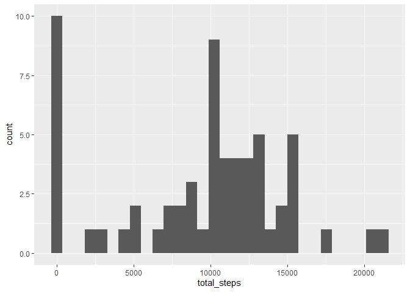
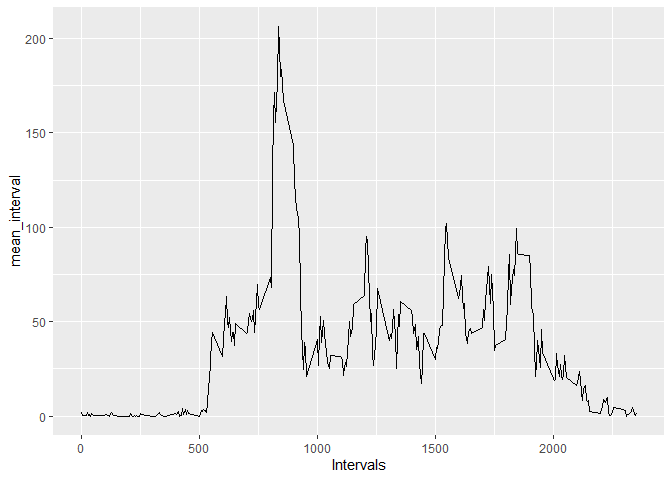
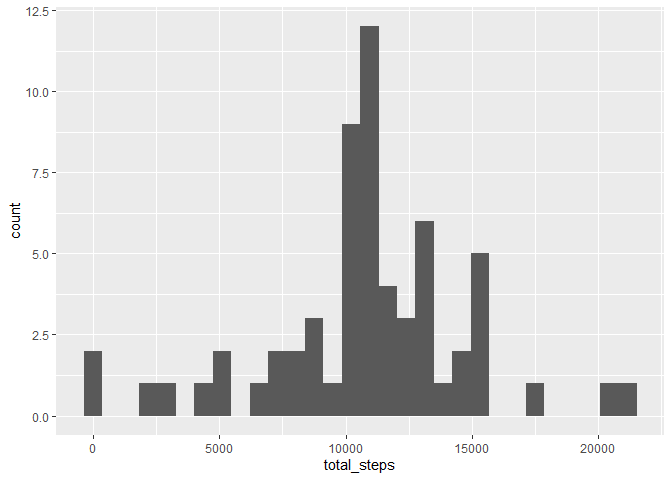
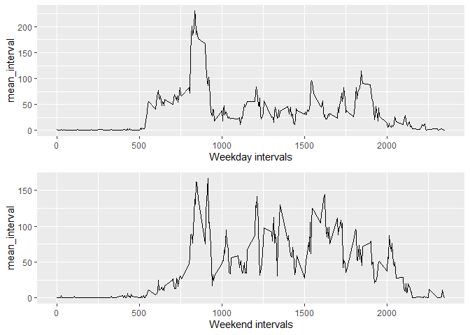

## Loading and preprocessing the data
In this section the dataset of activity monitoring from a csv file is loaded into a R dataframe to be ready for our analysis in next parts.

```r
activity<-read.csv('activity.csv')
activity$date <-as.Date(activity$date)
```


## What is mean total number of steps taken per day?

The first table shows the total steps per day. The plot shows the histogram of total number of steps taken each day. The second and third table demonstrates the mean and median step taken per day respectively.

```r
library(dplyr)
library(ggplot2)
total_steps <- activity %>% group_by(date) %>% summarize(total_steps=sum(steps,na.rm=TRUE))

print(total_steps)
```

```
## # A tibble: 61 x 2
##    date       total_steps
##    <date>           <int>
##  1 2012-10-01           0
##  2 2012-10-02         126
##  3 2012-10-03       11352
##  4 2012-10-04       12116
##  5 2012-10-05       13294
##  6 2012-10-06       15420
##  7 2012-10-07       11015
##  8 2012-10-08           0
##  9 2012-10-09       12811
## 10 2012-10-10        9900
## # ... with 51 more rows
```

```r
mean_steps <- activity %>% group_by(date) %>% summarize(mean_steps=mean(steps,na.rm=TRUE))


median_steps <- activity %>% group_by(date) %>% summarize(median_steps=median(steps,na.rm=TRUE))


ggplot(data=total_steps, aes(x=total_steps))+geom_histogram()
```

<!-- -->

```r
print(mean_steps)
```

```
## # A tibble: 61 x 2
##    date       mean_steps
##    <date>          <dbl>
##  1 2012-10-01    NaN    
##  2 2012-10-02      0.438
##  3 2012-10-03     39.4  
##  4 2012-10-04     42.1  
##  5 2012-10-05     46.2  
##  6 2012-10-06     53.5  
##  7 2012-10-07     38.2  
##  8 2012-10-08    NaN    
##  9 2012-10-09     44.5  
## 10 2012-10-10     34.4  
## # ... with 51 more rows
```

```r
print(median_steps)
```

```
## # A tibble: 61 x 2
##    date       median_steps
##    <date>            <dbl>
##  1 2012-10-01           NA
##  2 2012-10-02            0
##  3 2012-10-03            0
##  4 2012-10-04            0
##  5 2012-10-05            0
##  6 2012-10-06            0
##  7 2012-10-07            0
##  8 2012-10-08           NA
##  9 2012-10-09            0
## 10 2012-10-10            0
## # ... with 51 more rows
```


## What is the average daily activity pattern?
The plot shows average steps taken for different intervals ranging from 0 to 2355. It appears on average, interval 835 has maximum number of steps across all days.

```r
average_interval5 <- activity %>% group_by(interval) %>% summarize(mean_interval=mean(steps,na.rm= TRUE))
ggplot(average_interval5,aes(x=interval, y=mean_interval))+geom_line()+xlab('Intervals')
```

<!-- -->

```r
maximum=average_interval5[which.max(average_interval5$mean_interval),]
print(maximum)
```

```
## # A tibble: 1 x 2
##   interval mean_interval
##      <int>         <dbl>
## 1      835          206.
```


## Imputing missing value
The total number of missing values in the dataset is 2304 . For filling the missing values my strategy is using the mean for corresponding 5-minutes interval.


```r
na_count <- activity[is.na(activity$steps),]
print(nrow(na_count))
```

```
## [1] 2304
```

```r
filled<- activity %>% group_by(interval) %>% mutate(steps=ifelse(is.na(steps),mean(steps,na.rm = TRUE),steps))

total_steps_filled <-filled  %>% group_by(date) %>% summarize(total_steps=sum(steps,na.rm=TRUE))

mean_day_filled <- filled  %>% group_by(date) %>% summarize(mean_steps=mean(steps,na.rm=TRUE))
median_day_fileld <- filled  %>% group_by(date) %>% summarize(median_steps=median(steps,na.rm=TRUE))

print(mean_day_filled)
```

```
## # A tibble: 61 x 2
##    date       mean_steps
##    <date>          <dbl>
##  1 2012-10-01     37.4  
##  2 2012-10-02      0.438
##  3 2012-10-03     39.4  
##  4 2012-10-04     42.1  
##  5 2012-10-05     46.2  
##  6 2012-10-06     53.5  
##  7 2012-10-07     38.2  
##  8 2012-10-08     37.4  
##  9 2012-10-09     44.5  
## 10 2012-10-10     34.4  
## # ... with 51 more rows
```

```r
print(median_day_fileld)
```

```
## # A tibble: 61 x 2
##    date       median_steps
##    <date>            <dbl>
##  1 2012-10-01         34.1
##  2 2012-10-02          0  
##  3 2012-10-03          0  
##  4 2012-10-04          0  
##  5 2012-10-05          0  
##  6 2012-10-06          0  
##  7 2012-10-07          0  
##  8 2012-10-08         34.1
##  9 2012-10-09          0  
## 10 2012-10-10          0  
## # ... with 51 more rows
```

```r
ggplot(data=total_steps_filled, aes(x=total_steps))+geom_histogram()
```

<!-- -->


## Are there differences in activity patterns between weekdays and weekends?

```r
library(gridExtra)
filled$day_type <- ifelse(weekdays(filled$date)=="Saturday" | weekdays(filled$date)=="Sunday","Weekend","Weekday" )
average_interval5_filled <- filled %>% group_by(day_type,interval) %>% summarize(mean_interval=mean(steps,na.rm= TRUE))
week_days <- average_interval5_filled %>% filter(day_type=="Weekday")
weekend <- average_interval5_filled %>% filter(day_type=="Weekend")
plot1<- ggplot(week_days,aes(x=interval, y=mean_interval))+geom_line()+xlab('Weekday intervals')
plot2<- ggplot(weekend,aes(x=interval, y=mean_interval))+geom_line()+xlab('Weekend intervals')

grid.arrange(plot1,plot2,ncol=1)
```

<!-- -->
